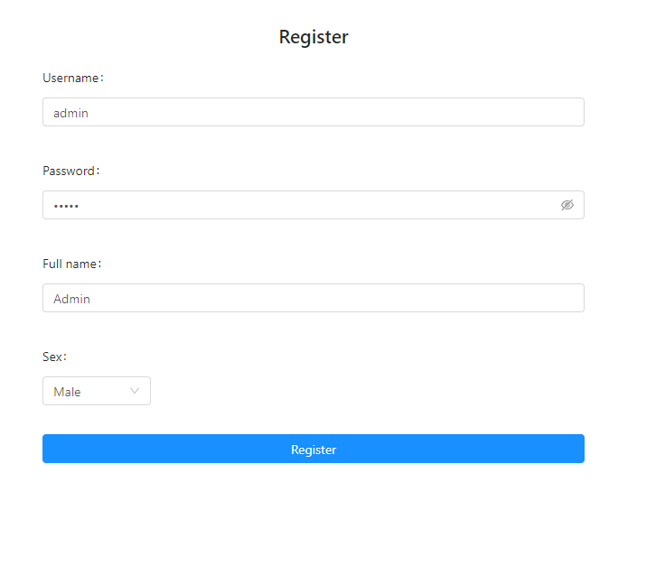
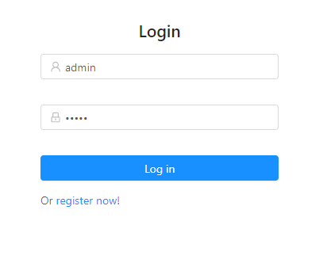
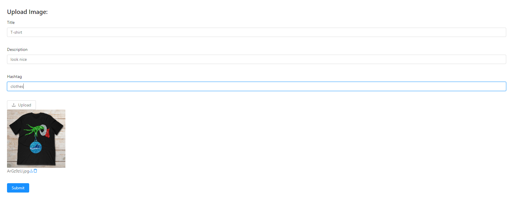
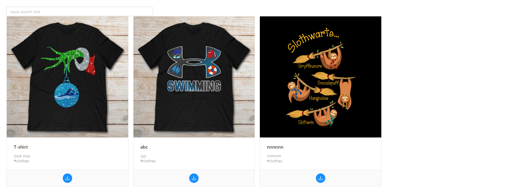

# Trang web upload ảnh trực tuyến
## Mục tiêu
```
Xây dựng trang web cho phép upload và lưu trữ ảnh trực tuyến.
```
## Công nghệ sử dụng
```
Back-end: NodeJS
Database: MongoDB
Front-end: ReactJS
```
## Hướng dẫn cài đặt
```
1. Khởi động server
Mở terminal ở folder 'src'
Tải các dependencies sử dụng lệnh: npm install
Khởi động server sử dụng lệnh: npm start
```


```
2. Khởi động frontend
Mở cửa sổ terminal khác ở folder 'frontend' trong folder 'src'
Tải các dependencies sử dụng lệnh: npm install
Khởi động sử dụng lệnh: npm start
Mở trình duyệt web và truy cập tại url: http://localhost:3000/
```


## Hướng dẫn sử dụng
1. Đăng ký
```
Giao diện form đăng kí
```


2. Đăng nhập
``` 
Giao diện form đăng nhập
```


3. Upload ảnh
```
Giao diện upload ảnh
```


4. Theo dõi các ảnh được đăng tải,tìm kiếm và download ảnh
```
Tại trang chủ có các ảnh được đăng tải, người có thể tìm kiếm ảnh theo title hoặc theo hashtag
```


## Demo video
```
Đã demo với giáo viên phụ trách.
```